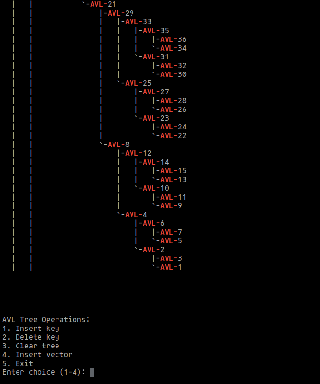

# АиСД
## Семестровая работа по структурам данных

## Build And Run
* Use script `./build.sh` in order to build project using CMake, run `./test.sh` to see gtests results or `./run.sh` to run main.cpp unit
* Or build manually in src folder using `g++ main.cpp utils/menu.cpp` in `src` folder
* If you run `./run.sh` on a Unix machine, you can view a live visualization of the AVL tree using `./run_pstree.sh`, which represents the tree nodes as processes and displays them on the screen via the **pstree** command.

## Pstree Example
* The implementation of the tree display via **pstree** is done for fun. Each node creates a child process when traversing the tree, so **pstree** outputs the nodes of the tree as a hierarchy of processes in the operating system  

Необходимо выполнить задание согласно выбранному варианту (согласовывается с преподавателем).
Реализация СД должна быть выполнена на языке программирования C++.
